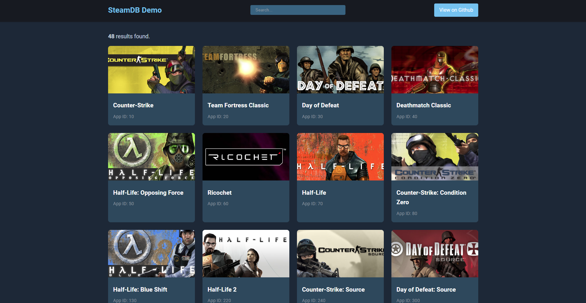

# Go_SteamDB
### My attempt to create a go web application to work with SteamAPI

At the moment, it allows you to search the entire database of Steam games (so far only by games, and only from Steam)

Now it looks like this:\

And it's still in development.

## Getting started

This is an example of how you may run this project locally. Follow these steps:

1. Clone the repo
   `git clone https://github.com/Manifure/Go_SteamDB`

2. Make sure [docker](https://www.docker.com/) is installed

3. Run
   `docker-compose up -d`

4. Go to `localhost:8082` in your browser